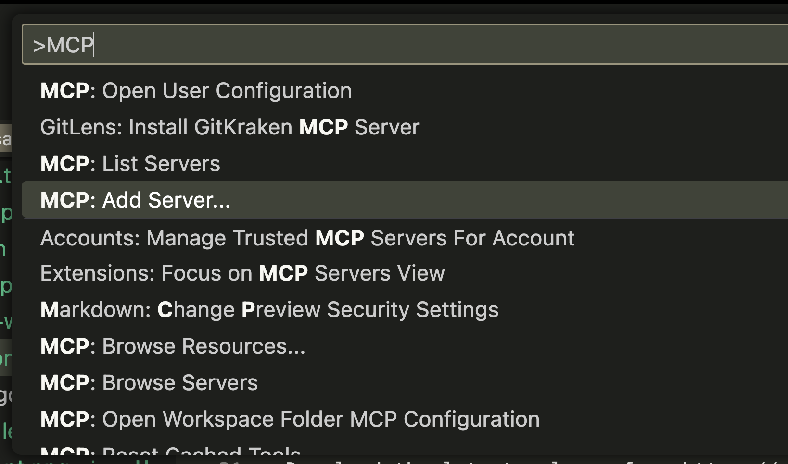

## Getting Started

Getting started is easy in a variety of ways.

- [GitLens](#gitlens)
- [GitKraken CLI](#gitkraken-cli)

### GitLens

With the latest version of [GitLens](https://www.gitkraken.com/gitlens) you can install the MCP Server easily from the command palette.

This will handle all of the configuration for you. You can then inspect the list of available MCP servers by making sure you are in Agent mode and clicking the gear icon in the bottom right corner of the copilot side panel.

Then, scroll through the list and you will see "MCP Server: GitKraken (bundled with GitLens)".

### GitKraken CLI (gitkraken-cli)

Download the latest release from [https://www.gitkraken.com/cli](https://www.gitkraken.com/cli)

After installation, run `gk auth login` in your terminal to authenticate with your GitKraken account.

After authentication, you will need to add the MCP server to your preferred agent.

#### VS Code

To install the MCP server into VS Code, you can run "MCP: Add server..." from the command palette.

In the following prompts, select "stdio" as the type of server.

In the next prompt, enter the command `gk mcp`.

Finally, give the server a name and press enter.

You can then inspect the list of available MCP servers and tools by making sure you are in Agent mode and clicking the gear icon in the bottom right corner of the copilot side panel.

#### Cursor

#### Claude Desktop

## Next Steps

Once you are done setting up the MCP server, head over to our [Example Workflows](02-example-workflows.md) for inspiration on how to use the MCP server to make your day-to-day tasks easier and less tedious.
